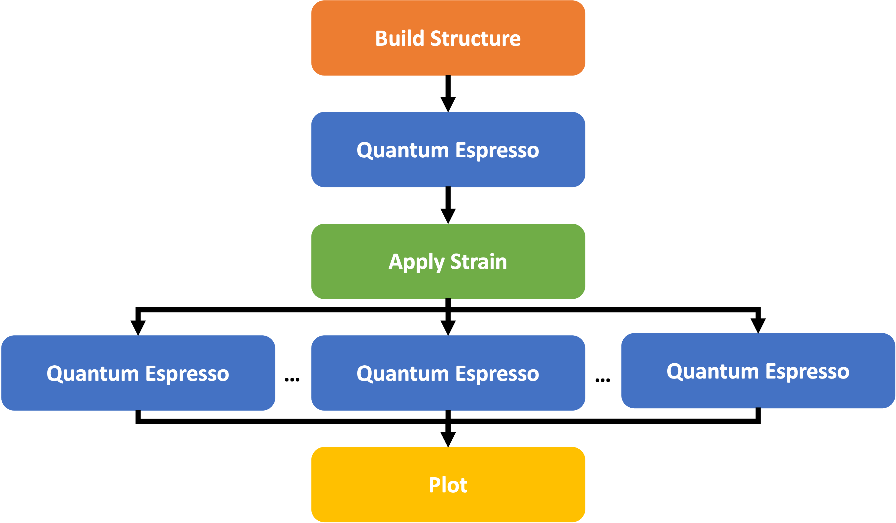

# Challenges
Over the recent years a number of simulation frameworks have been developed which address various aspects of the development of simulation protocols. The general challenges are: 

* Interface with the simulation codes**: While some modern simulation codes already provide Python bindings, the majority require simulation code-specific input files, have specific variable names and the internal unit system used by a given simulation code might differ depending on the community it was developed for.
* **Access to high-performance computing (HPC) resources**: Traditional queuing systems like the Simple Linux Utility for Resource Management (SLURM) handle the execution of compute-intensive tasks. Still in the context of up-scaling simulation protocols or parameter studies the tracking of which parameters lead to a successful calculation and which calculations failed remains a manual task. 
* **Efficient Data storage**: The input and output files of many simulation codes in the scientific community were intended to be human readable first and the machine readability was only a secondary concern. This resulted in a wide range of different formats of plain text files which are inefficient when the number of calculations increases.

In the following, we compare the implementation of the same workflow in four different simulation frameworks, namely AiiDA, jobflow, pyiron and Simstack. All four of these frameworks are released as open-source software and developed in the Python programming language

## Example Workflow



The comparison is focused on highlighting the implementation of a new simulation code and a simulation workflow in the four workflow frameworks. The calculation of a structure optimization followed by the calculation of the bulk modulus from fitting an energy volume curve with the quantum espresso open-source density functional theory (DFT) simulation code is chosen as an example workflow. The workflow consists of the following four steps: 

* Create a face-centred-cubic Aluminium supercell with 4 atoms and a lattice constant of 4.15A.
* Use the quantum espresso simulation code to optimize both the lattice constant and the positions in the crystal structure.
* Apply five strains ranging from -10% to +10% on the optimized structure to generate five strained structures. 
* Evaluate these five structures with Quantum Espresso to calculate the energy.
* Plot the resulting energy volume curve.

This workflow covers both a serial dependence of tasks as well as parallel execution of tasks. Rather than using the already existing framework-specific parsers to write the input files and parse the output files for the quantum espresso simulation code the same parser is implemented in all frameworks. This also highlights how new parsers can be developed in a general way to simplify the integration in existing simulation frameworks and enhance the parser's transferability.

## Implementation
The challenge is to develop a workflow in a way that is can be easily integrated in a number of workflow frameworks, to give the users the option to choose the workflow framework which best suits their needs.

### Python Function
For the case of python functions, integrating the function should ideally be as simple as setting a python decorator: 
```python
@job_decorator
def my_function(*args, **kwargs):
    ...
```

The generation of the strained structures can be represented as such a python function. It takes a single structure and a list of strains as an input and returns a list of strained structures as an output: 
```python
def generate_structures(structure, strain_lst): 
    structure_lst = []
    for strain in strain_lst:
        structure_strain = structure.copy()
        structure_strain.set_cell(
            structure_strain.cell * strain**(1/3), 
            scale_atoms=True
        )
        structure_lst.append(structure_strain)
    return structure_lst
```

In the same way, the plotting of the resulting energy volume curve can be represented as python functions:
```python
def plot_energy_volume_curve(volume_lst, energy_lst):
    plt.plot(volume_lst, energy_lst)
    plt.xlabel("Volume")
    plt.ylabel("Energy")
    plt.savefig("evcurve.png")
```

### External Executable
For the case of interfacing with an external executable three steps are required. The writing of the input files, the calling of the executable and the parsing of the output files. For interfacing with the quantum espresso DFT simulation code, the function to write the input files could be written as: 
```python
def write_input(input_dict, working_directory="."):
    filename = os.path.join(working_directory, 'input.pwi')
    os.makedirs(working_directory, exist_ok=True)
    write(
        filename=filename, 
        images=input_dict["structure"], 
        Crystal=True, 
        kpts=input_dict["kpts"], 
        input_data={
            'calculation': input_dict["calculation"],
            'occupations': 'smearing',
            'degauss': input_dict["smearing"],
        }, 
        pseudopotentials=input_dict["pseudopotentials"],
        tstress=True, 
        tprnfor=True
    )
```

Here all quantum espresso-specific inputs are defined by the `input_dict` and the additional `working_directory` specifies the directory in which the input should be written. In analogy, the function to collect the output of the quantum espresso calculation also receives the `working_directory` as input and returns the output as a python dictionary:
```python
def collect_output(working_directory="."):
    output = parse_pw(os.path.join(working_directory, "pwscf.xml"))
    return {
        "structure": output["ase_structure"],
        "energy": output["energy"],
        "volume": output["ase_structure"].get_volume(),
    }
```

By choosing to define both the input as well as the output as python dictionary, the interface is very flexible as it can be extended by additional elements. 

### Universal Interface
By following this recommendation of using python functions as well as external executables which are interfaced by one function to write the input and another function to parse the output any simulation workflow can be integrated in any of the four frameworks. This is demonstrated below for the workflow of calculating the energy volume curve with quantum espresso. 
